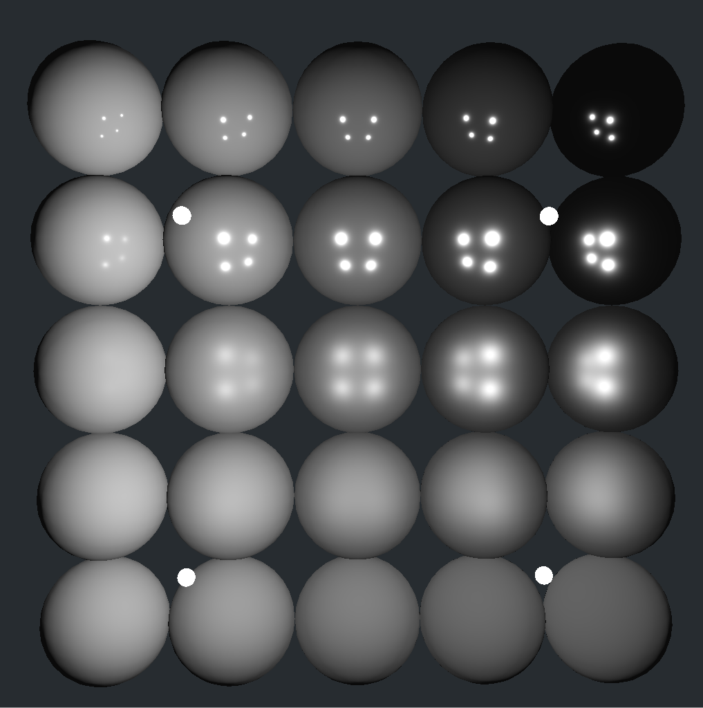
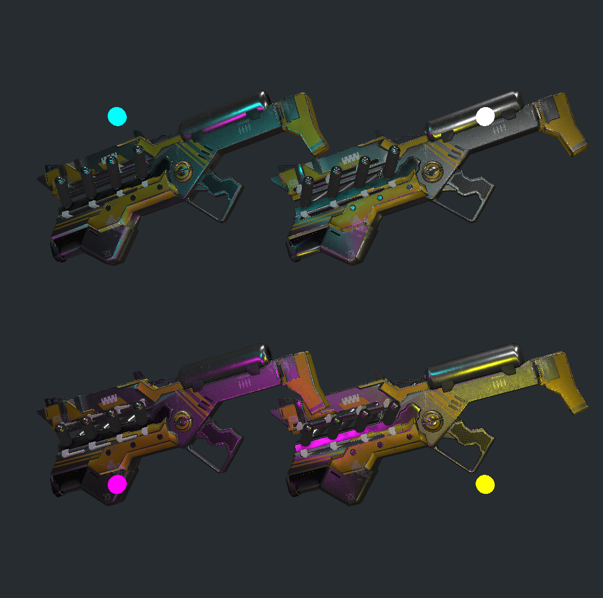

# Renderer
A 3D renderer using the Vulkan API.
An educational playground to figure out Vulkan, 3D graphics, and various rendering techniques

---
## Implemented
- Boilerplate Vulkan
- Models and textures
- Normal mapping
- Phong shading
- PBR shading

## Queued
- IBL
- Shadowmapping
- Deferred shading
- SSAO
- Ray tracing
- Better modularity
---

---
### Miscellaneous things I plan to learn & implement
- Mimicking real-world cameras
- Volumetric lighting
- Realtime super-high-poly model rendering
- Decals
- Custom model loading library
- Custom image loading library
- Platform-specific windowing (To move away from GLFW)
---

